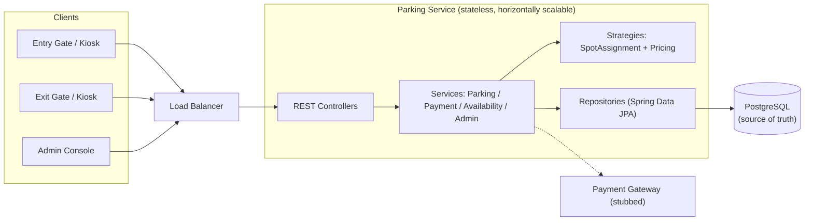
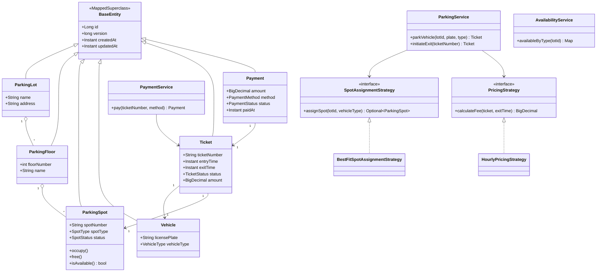
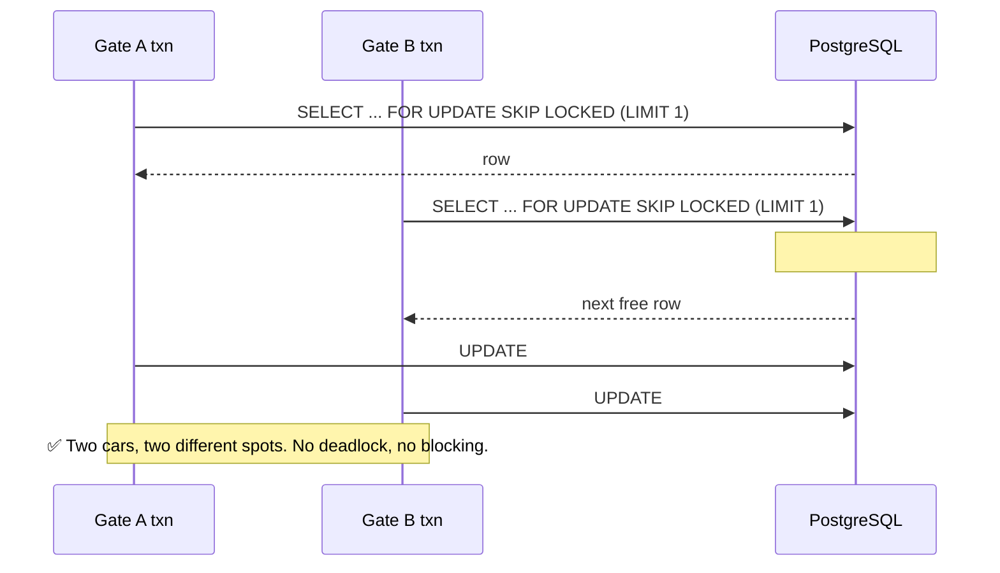
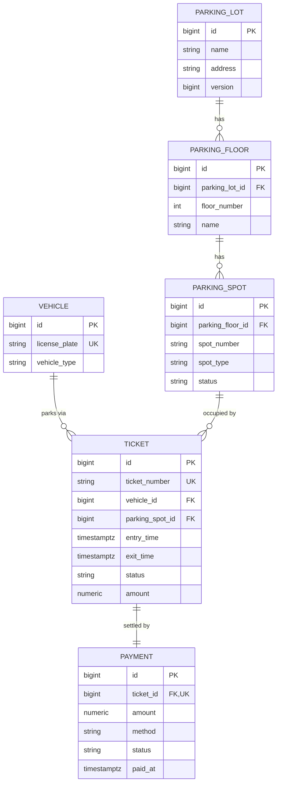
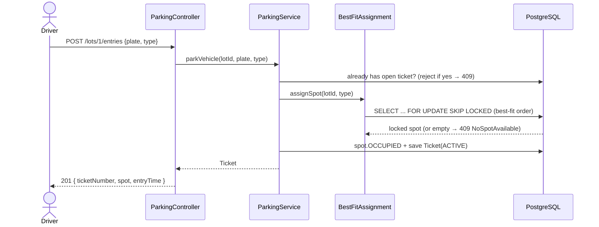
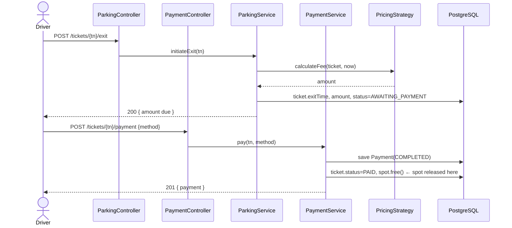
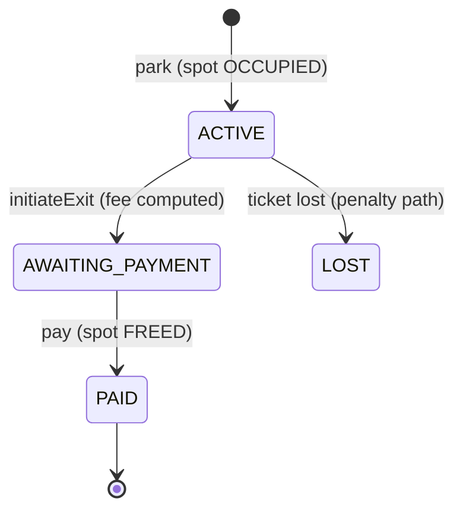
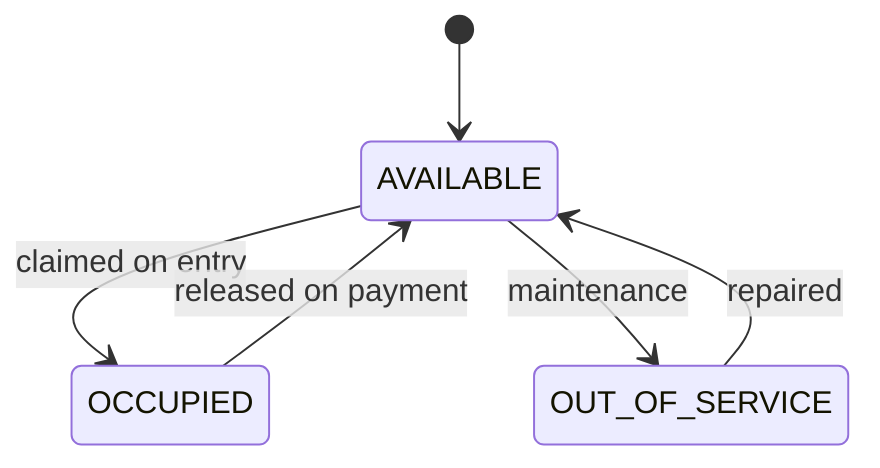
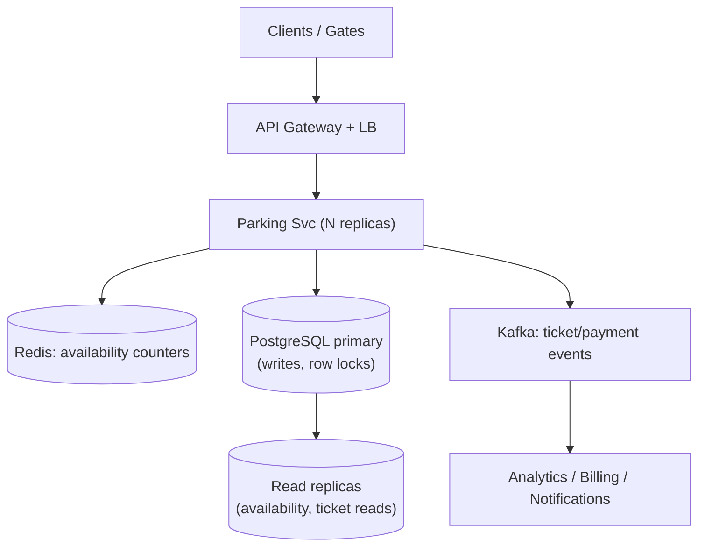

# Parking Lot System — Low-Level & High-Level Design

> A production-grade parking-lot service (Spring Boot 3 / Java 21 / PostgreSQL) built as a
> reference answer for the classic **"Design a Parking Lot"** MAANG interview.
>
> This README is written in the order you would actually present at a whiteboard:
> **Requirements → APIs → HLD → LLD → Patterns → Concurrency → Schema → Flows → Trade-offs → Scale.**

---

## Table of Contents

1. [Problem Statement](#1-problem-statement)
2. [Requirements](#2-requirements)
3. [Core Entities & Assumptions](#3-core-entities--assumptions)
4. [API Design](#4-api-design)
5. [High-Level Design (HLD)](#5-high-level-design-hld)
6. [Low-Level Design (LLD) — Class Diagram](#6-low-level-design-lld--class-diagram)
7. [Design Patterns Used](#7-design-patterns-used)
8. [Concurrency — The Heart of the Problem](#8-concurrency--the-heart-of-the-problem)
9. [Database Schema (ER Diagram)](#9-database-schema-er-diagram)
10. [Key Flows (Sequence Diagrams)](#10-key-flows-sequence-diagrams)
11. [State Machines](#11-state-machines)
12. [Pricing Model](#12-pricing-model)
13. [Trade-offs & Decisions](#13-trade-offs--decisions)
14. [Scaling to Millions (HLD extension)](#14-scaling-to-millions-hld-extension)
15. [How to Run](#15-how-to-run)
16. [Project Structure](#16-project-structure)

---

## 1. Problem Statement

Design a parking lot system that supports a multi-floor garage with different spot
types, admits vehicles, issues tickets, computes parking fees on exit, accepts
payment, and reports live availability — **correctly under concurrent traffic**
(many entry gates racing for the same spots).

---

## 2. Requirements

> **Interview tip:** Always split functional vs non-functional first, and explicitly
> call out what is **out of scope** to bound the problem.

### 2.1 Functional Requirements

| # | Requirement |
|---|-------------|
| F1 | A lot has multiple **floors**; each floor has multiple **spots**. |
| F2 | Spots have **types**: Motorcycle, Compact, Large, Electric, Handicapped. |
| F3 | Vehicles have **types**: Motorcycle, Car, Electric, Truck. |
| F4 | A vehicle can only park in a **compatible** spot; assignment is **best-fit** (tightest fitting spot first). |
| F5 | On entry, issue a **ticket** (entry time, assigned spot). |
| F6 | On exit, compute the **fee** based on duration and spot type. |
| F7 | Accept **payment**; release the spot only after payment succeeds. |
| F8 | Report **real-time availability** per spot type. |
| F9 | Admin can provision lots, floors, and spots. |

### 2.2 Non-Functional Requirements

| # | Requirement | How it's addressed |
|---|-------------|--------------------|
| N1 | **Correctness under concurrency** — never assign one spot to two vehicles. | `SELECT … FOR UPDATE SKIP LOCKED` (pessimistic lock). |
| N2 | **Consistency** — ticket/spot/payment never drift apart. | DB transactions; spot freed only inside the payment txn. |
| N3 | **Low latency** entry/exit (< 100 ms). | Single indexed locking query; no full scans. |
| N4 | **Extensibility** — new pricing / assignment rules without touching core. | Strategy pattern behind interfaces. |
| N5 | **Availability** — degrade gracefully, horizontally scalable app tier. | Stateless services; DB is the single source of truth. |
| N6 | **Auditability** — every entity carries created/updated timestamps + version. | `BaseEntity` with `@Version`, `@CreationTimestamp`. |

### 2.3 Out of Scope (state this explicitly!)

Reservations, dynamic/surge pricing, license-plate OCR / ANPR, real payment-gateway
integration (we stub it), multi-tenant operators, valet, EV charge metering.

### 2.4 Back-of-the-envelope (scope sizing)

```
1 large garage  ≈ 1,000–5,000 spots
Peak entry/exit ≈ a few requests/sec per gate, ~50–100 gates → ~hundreds of req/s
=> A single relational DB easily handles this. No sharding needed for one lot.
   (Section 14 covers the "1000s of lots / national operator" extension.)
```

---

## 3. Core Entities & Assumptions

- **ParkingLot** → has many **ParkingFloor** → has many **ParkingSpot**.
- **Vehicle** is identified by license plate (natural key).
- **Ticket** links a Vehicle to the Spot it occupies for one parking session.
- **Payment** settles one Ticket.
- A vehicle may have at most **one open ticket** at a time (can't be parked twice).
- Time is read through an injectable **`Clock`** (deterministic + testable).
- Money is **`BigDecimal`** in minor units; never `double`.

---

## 4. API Design

> REST, versioned under `/api/v1`. Resources are nouns; state transitions are
> sub-resource POSTs (`/exit`, `/payment`).

### Admin / setup

| Method | Path | Description | Success |
|--------|------|-------------|---------|
| `POST` | `/api/v1/lots` | Create a lot | `201` |
| `GET`  | `/api/v1/lots/{lotId}` | Fetch a lot | `200` |
| `POST` | `/api/v1/lots/{lotId}/floors` | Add a floor | `201` |
| `POST` | `/api/v1/floors/{floorId}/spots` | Bulk-provision spots | `201` |
| `GET`  | `/api/v1/lots/{lotId}/availability` | Live availability by type | `200` |

### Operations (entry / exit / payment)

| Method | Path | Description | Success |
|--------|------|-------------|---------|
| `POST` | `/api/v1/lots/{lotId}/entries` | Park a vehicle → issue ticket | `201` |
| `POST` | `/api/v1/tickets/{ticketNumber}/exit` | Compute fee, await payment | `200` |
| `POST` | `/api/v1/tickets/{ticketNumber}/payment` | Pay → release spot | `201` |
| `GET`  | `/api/v1/tickets/{ticketNumber}` | Ticket status | `200` |

### Error model (consistent envelope via `@RestControllerAdvice`)

| Condition | HTTP | Exception |
|-----------|------|-----------|
| Lot/floor/ticket not found | `404` | `ResourceNotFoundException` |
| Lot full for vehicle type | `409` | `NoSpotAvailableException` |
| Invalid state (double-park, pay non-awaiting ticket) | `409` | `InvalidParkingStateException` |
| Validation / malformed body / bad enum | `400` | `MethodArgumentNotValid` / `HttpMessageNotReadable` |

```json
// Example 409 body
{
  "timestamp": "2026-06-07T16:03:03Z",
  "status": 409,
  "error": "Conflict",
  "message": "No available spot for vehicle type TRUCK in lot 1",
  "path": "/api/v1/lots/1/entries",
  "fieldErrors": null
}
```

---

## 5. High-Level Design (HLD)



**Why this shape:**
- The **app tier is stateless** → scale out behind a load balancer; any instance
  can serve any gate.
- **PostgreSQL is the single source of truth** for spot state. Correctness
  (N1) is enforced *in the database* with row locks, not in app memory — so it
  holds even with many app instances.
- **Strategies** are injected, so pricing/assignment policy is swappable without
  touching controllers or DB code.

---

## 6. Low-Level Design (LLD) — Class Diagram



### Enum responsibilities (the "smart enum" trick interviewers like)

`VehicleType` owns its compatibility rules, ordered by **best fit**:

```
MOTORCYCLE → [MOTORCYCLE, COMPACT, LARGE]
CAR        → [COMPACT, LARGE]
ELECTRIC   → [ELECTRIC, COMPACT, LARGE]
TRUCK      → [LARGE]
```

The assignment strategy simply walks this list and claims the first type with a
free spot — so a Car takes a Compact before consuming a Large, leaving Large
spots for Trucks.

---

## 7. Design Patterns Used

| Pattern | Where | Why |
|---------|-------|-----|
| **Strategy** | `SpotAssignmentStrategy`, `PricingStrategy` | Swap assignment (best-fit / nearest / random) and pricing (hourly / flat / surge) without touching callers. Open/Closed Principle. |
| **Factory (static)** | DTO `from(...)` / `of(...)` methods | Centralize entity→DTO mapping. |
| **Dependency Injection** | Everywhere (Spring constructor injection) | Testability, loose coupling. |
| **Repository** | `*Repository` interfaces | Abstract persistence; mock in unit tests. |
| **Singleton** | Spring beans (services, strategies, `Clock`) | One shared, stateless instance. |
| **Template Method (implicit)** | `BaseEntity` | Shared identity/versioning/audit for all entities. |
| **Value Object** | `record` DTOs | Immutable request/response payloads. |

> **Extension story for the interviewer:** "To add surge pricing, I implement a new
> `PricingStrategy` and inject it — zero changes to `ParkingService`. To park
> nearest-to-elevator instead of best-fit, I implement a new
> `SpotAssignmentStrategy`. That's the Open/Closed Principle in action."

---

## 8. Concurrency — The Heart of the Problem

> This is what the interview is really testing. Two cars arrive at two gates at the
> same millisecond and there is **one** Compact spot left. Exactly one must win.

### 8.1 The race condition (naïve approach — WRONG)

```
Gate A: SELECT free spot  -> spot #42
Gate B: SELECT free spot  -> spot #42   (B reads before A writes)
Gate A: UPDATE #42 OCCUPIED
Gate B: UPDATE #42 OCCUPIED              ❌ two cars, one spot
```

### 8.2 The fix — pessimistic row lock with `SKIP LOCKED`

The repository query takes a **`PESSIMISTIC_WRITE`** lock and uses the lock-timeout
hint `-2`, which Hibernate maps to **`SKIP LOCKED`**. On PostgreSQL this emits:

```sql
SELECT * FROM parking_spot
WHERE parking_lot_id = ? AND spot_type = ? AND status = 'AVAILABLE'
ORDER BY spot_number
LIMIT 1
FOR UPDATE SKIP LOCKED;     -- ← the magic
```



### 8.3 Why `SKIP LOCKED` and not the alternatives

| Approach | Problem |
|----------|---------|
| App-level `synchronized` / single lock | Doesn't work across multiple app instances; kills throughput. |
| `FOR UPDATE` (plain, blocking) | Gate B **waits** for A to commit, then re-reads — serializes all entries, adds latency. |
| **`FOR UPDATE SKIP LOCKED`** ✅ | Gate B instantly skips the locked row and grabs the next free one. **No blocking, no deadlock, max throughput.** |
| Optimistic locking (`@Version`) only | Works, but causes retry storms under contention for the *same* hot rows. |

> We still keep `@Version` on every entity for general optimistic locking on
> ordinary updates; `SKIP LOCKED` is the specialized tool for the hot spot-claim path.

### 8.4 Transaction boundary

`parkVehicle()` runs in **one** `@Transactional` method: claim-lock the spot →
mark `OCCUPIED` → create ticket → commit. The lock is held for the whole (short)
transaction, so no other txn can grab the same row in between.

---

## 9. Database Schema (ER Diagram)



### Indexing strategy (call this out!)

- **`parking_spot (parking_lot_id, spot_type, status, spot_number)`** — composite
  index that makes the hot `findClaimableSpots` query an index range scan, not a table scan.
- `vehicle (license_plate)` — UNIQUE; fast lookup + "already parked" check.
- `ticket (ticket_number)` — UNIQUE; the customer-facing handle.
- Unique constraints: `(parking_lot_id, floor_number)`, `(parking_floor_id, spot_number)`
  prevent duplicate floors/spots.

---

## 10. Key Flows (Sequence Diagrams)

### 10.1 Park a vehicle (entry)



### 10.2 Exit + payment



> **Design choice:** the spot is freed **only after payment completes**, inside the
> payment transaction — so a driver can't vacate the system's record of the spot
> without paying.

---

## 11. State Machines

### Ticket lifecycle



### Spot lifecycle



---

## 12. Pricing Model

`HourlyPricingStrategy`: `fee = baseFee + ceil(hours) × hourlyRate(spotType)`,
with a configurable grace period.

- Stays within `freeMinutes` (default 15) → charged only the base fee.
- Partial hours **round up** (garage convention): 1h1m → 2 billable hours.
- Rates are **externalized** in `application.properties` (`parking.pricing.*`),
  bound via `@ConfigurationProperties` — change pricing without recompiling.

```
COMPACT=20/hr, LARGE=30/hr, ELECTRIC=25/hr ...
e.g. Truck (LARGE) parked 2h1m, baseFee 5 → 5 + 3×30 = 95
```

---

## 13. Trade-offs & Decisions

| Decision | Chosen | Alternative | Why |
|----------|--------|-------------|-----|
| Spot-claim concurrency | `FOR UPDATE SKIP LOCKED` | App lock / optimistic retry | Correct across instances, non-blocking, high throughput. |
| Source of truth | Relational DB | In-memory grid | One lot's load fits a single DB; ACID for free. |
| Spot release timing | After payment | At exit scan | Prevents "leave without paying" record drift. |
| Assignment policy | Best-fit | First-available | Preserves large spots for large vehicles. |
| Money type | `BigDecimal` | `double` | No floating-point rounding errors. |
| Time source | Injected `Clock` | `Instant.now()` | Deterministic, testable. |
| ID generation | DB identity | UUID PK | Simpler, sequential, index-friendly (ticket gets a separate opaque `ticket_number`). |

---

## 14. Scaling to Millions (HLD extension)

> When the interviewer says *"now make it work for a national operator with 10,000 lots."*



- **Shard by `lotId`** (or region) — each lot's spots are independent, so the
  natural partition key is the lot. No cross-lot transactions.
- **Read replicas** for availability + ticket lookups (read-heavy); writes
  (claim/release) go to primary where the row locks live.
- **Redis counters** for `availableByType` to avoid hitting the DB on every
  availability poll; reconciled from the DB (source of truth).
- **Event stream (Kafka)** for payments/tickets → analytics, billing,
  notifications, without coupling the hot path.
- App tier already **stateless** → just add replicas behind the LB.
- **Idempotency keys** on entry/payment so client retries don't double-charge or
  double-issue.

---

## 15. How to Run

> Requires JDK 21 and Docker (PostgreSQL is auto-started via `compose.yaml`).

```bash
# Run all tests (no Docker needed — uses in-memory H2)
./mvnw test

# Run the app (auto-starts PostgreSQL 17 via Spring Docker Compose support)
# Note: port 8080 may be busy on this machine → use 8081
./mvnw spring-boot:run -Dspring-boot.run.arguments=--server.port=8081
```

A sample lot (`id=1`, 2 floors, 50 spots) is seeded on first start
(`parking.seed.enabled=true`).

### Quick smoke test

```bash
B=http://localhost:8081/api/v1
curl -s $B/lots/1/availability
curl -s -X POST $B/lots/1/entries -H 'Content-Type: application/json' \
     -d '{"licensePlate":"KA01AB1234","vehicleType":"CAR"}'
# → take the ticketNumber from the response, then:
curl -s -X POST $B/tickets/<TN>/exit
curl -s -X POST $B/tickets/<TN>/payment -H 'Content-Type: application/json' \
     -d '{"method":"CARD"}'
```

---

## 16. Project Structure

```
src/main/java/com/sds/parkinglotsystem/
├── config/            # ApplicationConfig (Clock bean), DataInitializer (seed)
├── domain/
│   ├── enums/         # SpotType, VehicleType, SpotStatus, TicketStatus, Payment*
│   └── model/         # BaseEntity + JPA entities
├── exception/         # ResourceNotFound, NoSpotAvailable, InvalidParkingState
├── repository/        # Spring Data JPA repos (incl. SKIP LOCKED query)
├── service/           # ParkingLotAdmin, Parking, Payment, Availability
├── strategy/
│   ├── spot/          # SpotAssignmentStrategy + BestFit impl
│   └── pricing/       # PricingStrategy + Hourly impl + PricingProperties
└── web/
    ├── controller/    # Admin, Parking, Payment controllers
    ├── dto/           # Request/response records
    └── error/         # ApiError + GlobalExceptionHandler

src/test/java/...      # Unit (pricing, enums) + Mockito service tests + context test
```

---

### Interview cheat-sheet (the 5 things to say out loud)

1. **Best-fit assignment** via a `VehicleType → [SpotType...]` preference list.
2. **`SELECT … FOR UPDATE SKIP LOCKED`** is how two gates never get the same spot — non-blocking, multi-instance safe.
3. **Strategy pattern** for pricing & assignment → Open/Closed, easy to extend.
4. **Spot released only inside the payment transaction** → no "leave without paying" drift.
5. **Stateless app + DB as source of truth** → shard by `lotId` to scale horizontally.
